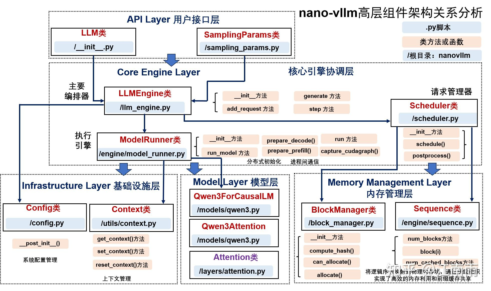

# Deep Dive into Nano-VLLM

TLDR:此文档高度参考[nano-vLLM 学习后记：如何设计一个轻量推理引擎](https://zhuanlan.zhihu.com/p/1977336847567983629)

## 项目结构 & 技术特点介绍 
### 项目结构  
```shell
nanovllm/
├── engine/                    #   推理引擎核心
│   ├── llm_engine.py         #   └── 总协调器，驱动整个推理流程
│   ├── scheduler.py          #   └── 智能调度器，决定执行顺序
│   ├── block_manager.py      #   └── KV缓存内存管理 (PagedAttention核心)
│   ├── model_runner.py       #   └── 单GPU上的模型执行器
│   └── sequence.py           #   └── 请求序列的数据结构
├── layers/                    # ⚙️ 神经网络层实现
│   ├── attention.py          #   └── FlashAttention + KV缓存管理
│   ├── sampler.py            #   └── 从logits采样生成token
│   ├── linear.py             #   └── 支持张量并行的线性层
│   ├── layernorm.py          #   └── RMS LayerNorm
│   ├── rotary_embedding.py   #   └── 旋转位置编码 (RoPE)
│   ├── activation.py         #   └── 激活函数 (SiLU)
│   └── embed_head.py         #   └── 词嵌入和语言模型头
├── models/                    #  ️ 具体模型架构
│   └── qwen3.py              #   └── Qwen3模型完整实现
├── utils/                     #   工具模块
│   ├── context.py            #   └── 全局上下文状态管理
│   └── loader.py             #   └── 模型权重加载器
├── config.py                 # ⚙️ 配置管理
├── llm.py                   #   用户接口入口
└── sampling_params.py       #   采样参数定义
```

### NanoVLLM支持哪些优化？  
nanovllm采纳了模型推理的一些常用优化技巧，包括： 
* paged attention & kv cache & prefix cache
* Tensor Parallelism
* CUDA Graph
* torch.compile -> Triton Kernel优化（图层算子融合）

## 全流程梳理  

首先我们先明确nanovllm中有哪些组件，各自的职责划分：  

如下是各个部件的职责划分:key::key:：  
| 组件 | 职责 |
| :--- | :--- |
| **LLMEngine** | 主循环，协调调度和执行 |
| **Scheduler** | 决定每一步执行哪些请求 |
| **BlockManager** | 页式 KV 缓存的分配与回收 |
| **ModelRunner** | 准备输入、执行模型、处理输出 |
| **Attention** | 集成 Flash Attention 和 KV Cache 写入 |
| **并行层** | 支持张量并行的线性层和 Embedding |

这些组件的整体数据流程如下：  
```shell
用户请求 → LLMEngine.add_request() → Scheduler.waiting 队列
                                          ↓
主循环 → Scheduler.schedule() → 选出本步要执行的请求
                                          ↓
       → ModelRunner.run() → 模型前向 + 采样
                                          ↓
       → Scheduler.postprocess() → 更新状态，终止判断
                                          ↓
       → 输出完成的请求
```

这里再提供一个清晰的架构图辅助理解：  


接下来深入各个组件详细分析这些组件的逻辑流程以及技术特点。

## NanoVLLM各模块详解
### 推理调度（Scheduler类）

一个性能良好的调度器需要考虑哪些因素？  
1. LLM inference有prefill和decode两个阶段，需要加以区分  
2. 资源是有限的（显存，计算带宽）
3. 请求状态是不断变化的   

调度器的目标是在这些约束下，最大化吞吐量，优化Time To First Token时间（TTFT）。

调度逻辑流程图如下：  
```shell
schedule() 被调用
    ├─ waiting 非空？
    │   ├─ 是：尝试 Prefill admit
    │   │       逐个检查 waiting 队首
    │   │       满足约束则 allocate + RUNNING + 移入 running
    │   │       返回 (scheduled, is_prefill=True)
    │   └─ 否：进入 Decode
    │           逐个处理 running
    │           需要新块但没有？抢占其他请求或自抢占
    │           may_append
    │           返回 (scheduled, is_prefill=False)
    │
postprocess() 被调用
    ├─ 追加 token
    └─ 检查终止，deallocate + FINISHED
```

#### 调度阶段参数  

* 每一步batch大小
    * max_num_seqs 限制同时处理的最大请求
    * max_num_batched_tokens 限制一步最多处理的 token 数。

### KV cache管理（BLockManager类 & Sequence类）
>:question:为什么需要分页机制？  
> * 传统kv cache需要预先分配最大缓存空间。比如最大序列长度是4096，则分配4096个位置的kv cache。但是如果实际序列是有十个，那么大量空间浪费。  
> * 存储碎片化问题，这一点和操作系统引入分页机制的原因一样。  

NanoVLLM中，KV cache管理的代码在`BlockManager.py`文件中。整个管理机制大体分为三个部分：  
1. Block 数据结构
2. BlockManager，用来为每个sequence管理block开辟/复用/销毁 （prefix cache等技术细节都在这个类中，感兴趣读者自行阅读源码理解） 
3. 实际物理存储布局，这一块主要有两个步骤：  
    * 系统启动时，根据可用显存计算能分配多少块物理block。 
    * 给kv cache分配一个大张量，并按照attention的每层layer划分切片。

### 执行引擎（ModelRunner类 & 模型实现）
调度器选出了**本步要执行的请求**，BlockManager 分配了 **KV Cache 的物理块**。现在需要把这些信息转换成模型能接受的输入格式，执行前向传播，然后采样得到下一个 token。

## 技术细节解读  
### KV cache + prefix cache + 页表管理  

### CUDA graph技术细节  

### Tensor Parallelism详解  
Qwen的一层主要包含Attention + FFN，其中Attention可以完全并行，而FFN涉及`hidden → intermediate → hidden`的线性变化，需要并行通信。

#### 并行通信
NanoVLLM中采用先列并行再行并行的模式，策略如下：
| 层类型 | 切分方式 | 通信操作 | 时机 |
| :--- | :--- | :--- | :--- |
| ColumnParallel | 输出维 | 无 | - |
| RowParallel | 输入维 | all_reduce | forward 后 |
| VocabParallelEmbedding | 词表维 | all_reduce | forward 后 |
| ParallelLMHead | 词表维 | gather (到 rank 0) | forward 后 |

`列并行`：
```cpp
W = [W_0 | W_1 | ... | W_{n-1}]   每个 rank 持有 W_i

每个 rank 计算: Y_i = X @ W_i
最终输出: Y = [Y_0 | Y_1 | ... | Y_{n-1}]  (沿特征维拼接)
```

`行并行`：
```cpp
W = [W_0]
    [W_1]
    [...]
    [W_{n-1}]   每个 rank 持有 W_i

输入也要对应切分: X = [X_0 | X_1 | ... | X_{n-1}]
每个 rank 计算: Y_i = X_i @ W_i
最终输出: Y = sum(Y_0, Y_1, ..., Y_{n-1})  (需要 all_reduce)
```

#### 多卡IPC通信 
> :key:注意区分进程间通信和NCCL通信。

除了 NCCL 的集合通信，还需要 rank 0 向其他 rank 广播控制信息（比如要执行哪个方法、参数是什么）。这里的IPC通信通过shared memory来传输数据。

## 总结  
```cpp
step() 被调用
    │
    ├─ scheduler.schedule()
    │   ├─ waiting 非空？尝试 Prefill admit
    │   └─ 否则 Decode，必要时抢占
    │
    ├─ model_runner.call("run", seqs, is_prefill)
    │   ├─ prepare_prefill() 或 prepare_decode()
    │   │   └─ 构造 input_ids, positions, slot_mapping, ...
    │   │   └─ set_context(...)
    │   │
    │   ├─ run_model()
    │   │   ├─ Prefill/Eager: model(input_ids) → compute_logits()
    │   │   └─ Graph: staging → replay → compute_logits()
    │   │
    │   ├─ sampler(logits, temperatures)
    │   │   └─ 只在 rank 0 执行
    │   │
    │   └─ reset_context()
    │
    └─ scheduler.postprocess(seqs, token_ids)
        ├─ 追加 token
        ├─ 检查终止条件
        └─ 终止的序列 deallocate + FINISHED
```

一些重要参数：  
| 参数 | 影响 |
| :--- | :--- |
| max_num_batched_tokens | Prefill 吞吐上限，太大可能 OOM |
| max_num_seqs | 并发度上限，影响 Decode 吞吐 |
| max_model_len | 决定 Graph 捕获时的 block_tables 大小 |
| gpu_memory_utilization | KV Cache 块数，太高容易 OOM |
| kvcache_block_size | 块粒度，影响缓存命中率和元数据开销 |
| enforce_eager | 调试用，关闭 Graph 便于排查问题 |


## 参考资料  
1. [一条prompt的推理之路](https://www.zhihu.com/search?type=content&q=nanovllm)
2. [nano-vllm源码详细阅读](https://kinnari-blog.vercel.app/posts/nano-vllm/note/)
3. [nano-vllm技术概览](https://zhuanlan.zhihu.com/p/1925484783229698084)
4. [nano-vllm学习后记](https://zhuanlan.zhihu.com/p/1977336847567983629) :fire:

:fire::fire:核心参考资料  
1. [NanoVLLM part1](https://neutree.ai/blog/nano-vllm-part-1)
2. [NanoVLLM part2](https://neutree.ai/blog/nano-vllm-part-2)
3. [VLLM入门文档](https://www.aleksagordic.com/blog/vllm)