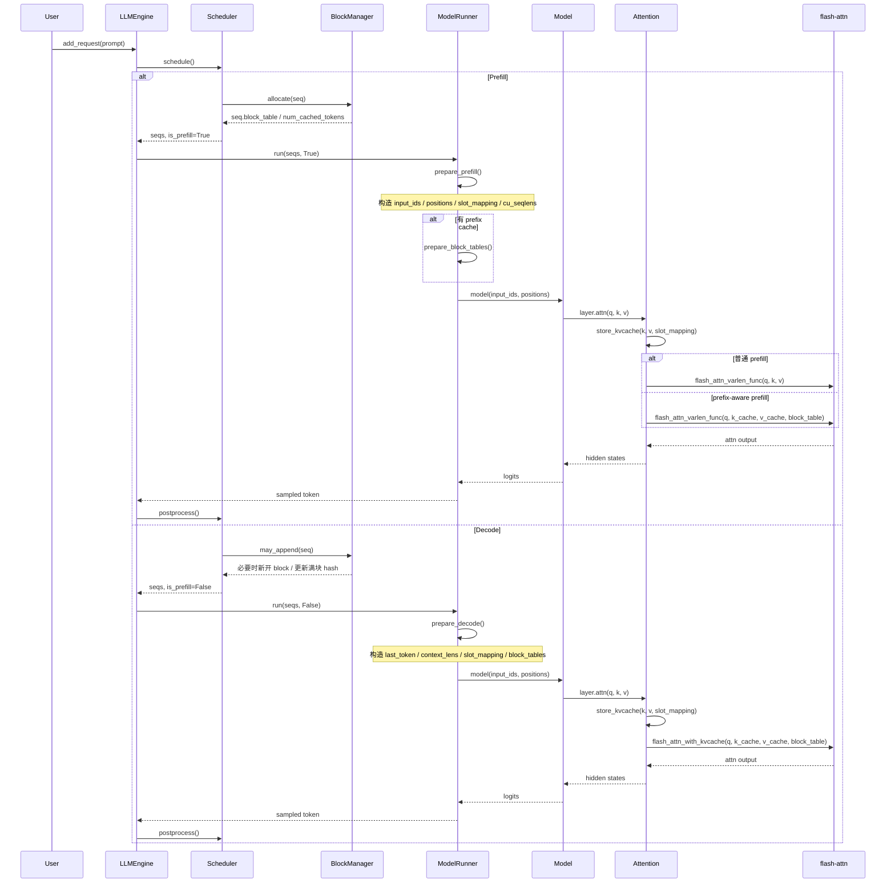

# NanoVLLM Paged Attention 简明文档

这份文档只回答一个问题：`nano-vllm` 里，Paged Attention 是怎么从请求进入，一路跑到 attention kernel 的。

相关源码：

- `nanovllm/engine/llm_engine.py`
- `nanovllm/engine/scheduler.py`
- `nanovllm/engine/block_manager.py`
- `nanovllm/engine/model_runner.py`
- `nanovllm/layers/attention.py`
- `nanovllm/engine/sequence.py`

## 1. 一句话概括

`nano-vllm` 自己实现了两件事：

- 页式 KV Cache 的管理：`block_table`、block 分配回收、prefix cache 复用
- 新产生 KV 的写入：通过 Triton kernel 按 `slot_mapping` 写到物理 cache

真正的分页 KV 读取和 attention 计算，交给 `flash-attn`：

- prefill: `flash_attn_varlen_func`
- decode: `flash_attn_with_kvcache`

## 2. 核心数据结构

### 2.1 Sequence

每个请求对应一个 `Sequence`，其中和 paged attention 直接相关的字段是：

- `block_table`: 逻辑块 -> 物理块 id
- `num_cached_tokens`: prefix cache 命中的 token 数
- `num_computed_tokens`: 已经真正做过 forward 的 token 数

见：[`nanovllm/engine/sequence.py`](../nanovllm/engine/sequence.py)

### 2.2 物理 KV Cache

`ModelRunner.allocate_kv_cache()` 启动时一次性预分配整块物理 cache：

```python
kv_cache.shape = [
    2,                  # K / V
    num_layers,
    num_blocks,
    block_size,
    num_kv_heads,
    head_dim,
]
```

每层 attention 拿到自己的切片：

```python
module.k_cache = kv_cache[0, layer_id]
module.v_cache = kv_cache[1, layer_id]
```

### 2.3 block_table 和 slot_mapping

逻辑 token 位置 `t` 的物理地址不是连续的，而是通过页表间接寻址：

```text
logical_block = t // block_size
offset        = t % block_size
slot          = block_table[logical_block] * block_size + offset
```

- `block_table` 负责“逻辑块 -> 物理块”
- `slot_mapping` 负责“这次 forward 产生的每个 token，要写到哪个物理 slot”

## 3. 端到端时序图



## 4. 三条执行路径

### 4.1 普通 Prefill

场景：

- 新请求第一次进入
- 没有 prefix cache 命中

特点：

- `num_cached_tokens == 0`
- `Q == K`
- `block_tables is None`

执行方式：

1. `BlockManager.allocate()` 给序列分配物理块
2. `prepare_prefill()` 打平 prompt，生成 `slot_mapping`
3. `Attention.store_kvcache()` 把本轮产生的 K/V 写入 cache
4. `flash_attn_varlen_func()` 直接使用当前 dense `k/v` 做 attention

注意：

- 这里虽然写了 KV cache，但本轮 attention 读的还是当前前向算出来的 dense `k/v`
- cache 主要是给后续 decode 用

### 4.2 Prefix Cache Prefill

场景：

- prompt 前缀的一些完整 block 之前已经算过

特点：

- `num_cached_tokens > 0`
- `num_computed_tokens = num_cached_tokens`
- `Q < K`
- `block_tables is not None`

执行方式：

1. `BlockManager.allocate()` 对每个完整 block 计算链式 hash
2. 命中的 block 直接复用，`ref_count += 1`
3. `prepare_prefill()` 只为未命中的 suffix 构造 `slot_mapping`
4. `Attention.store_kvcache()` 只写 suffix 的 KV
5. `flash_attn_varlen_func()` 改为从 `k_cache/v_cache + block_table` 读取完整历史 KV

关键点：

- prefix cache 的本质不是“跳过 attention”
- 而是“跳过已命中前缀的重新计算，但 attention 仍然要看到完整上下文”

### 4.3 Decode

场景：

- prefill 已经结束，开始逐 token 生成

特点：

- 每个序列这一步只输入一个 token
- `block_tables` 总是存在
- attention 始终从 paged KV cache 读完整历史

执行方式：

1. `Scheduler._schedule_decode()` 选中一批 running 序列
2. `BlockManager.may_append()` 在必要时：
   - 新开一个 block
   - 或在块写满时补算 hash，放进 prefix cache 索引
3. `prepare_decode()` 构造：
   - `input_ids = seq.last_token`
   - `positions = len(seq) - 1`
   - `slot_mapping = 当前 token 对应的物理 slot`
   - `context_lens = 每个序列当前总长度`
   - `block_tables = 页表`
4. `Attention.store_kvcache()` 把这个 token 的 K/V 写入 cache
5. `flash_attn_with_kvcache()` 按 `block_table` 从 paged cache 读取全部历史 KV

## 5. Block 生命周期

### 5.1 分配

`BlockManager.allocate(seq)`：

- 新序列进入 prefill 时执行
- 若 prefix hash 命中，复用已有 block
- 若未命中，从 `free_block_ids` 里拿空闲物理块
- 最终把所有物理块 id 追加到 `seq.block_table`

### 5.2 追加

`BlockManager.may_append(seq)`：

- decode 前调用
- 若新 token 让序列进入新 block，则先分配新块
- 若旧 block 刚好写满，则给该 block 补 hash，加入 prefix cache 索引

### 5.3 释放

`BlockManager.deallocate(seq)`：

- 序列结束或被抢占时调用
- 逆序遍历 `seq.block_table`
- `ref_count` 归零后才真正回收到 free list

## 6. 源码阅读顺序

建议按这个顺序看，最不容易绕晕：

1. [`nanovllm/engine/sequence.py`](../nanovllm/engine/sequence.py)
2. [`nanovllm/engine/block_manager.py`](../nanovllm/engine/block_manager.py)
3. [`nanovllm/engine/scheduler.py`](../nanovllm/engine/scheduler.py)
4. [`nanovllm/engine/model_runner.py`](../nanovllm/engine/model_runner.py)
5. [`nanovllm/layers/attention.py`](../nanovllm/layers/attention.py)

## 7. 最后只记住这三句话

1. `block_table` 解决的是“历史 KV 存在哪里”。
2. `slot_mapping` 解决的是“这次新算出来的 KV 要写到哪里”。
3. `flash-attn + block_table` 解决的是“如何从分页 cache 读取完整历史并完成 attention”。
